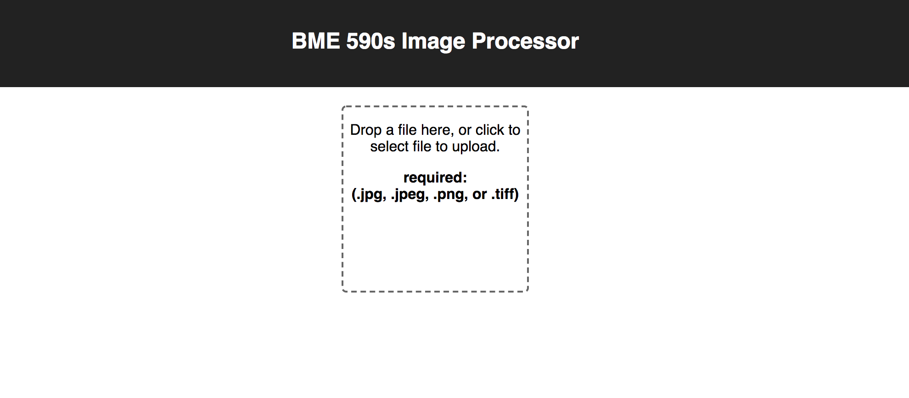
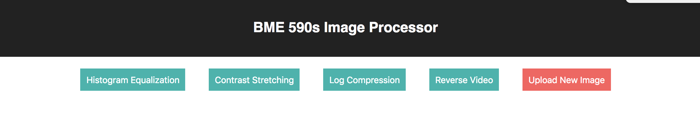
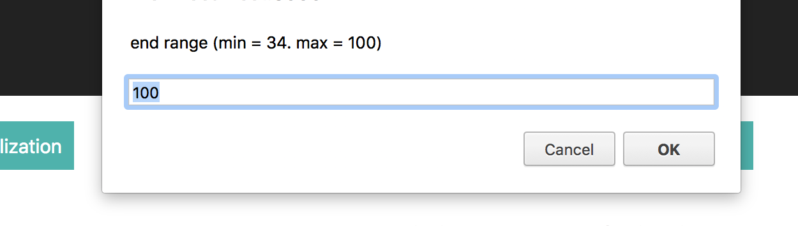
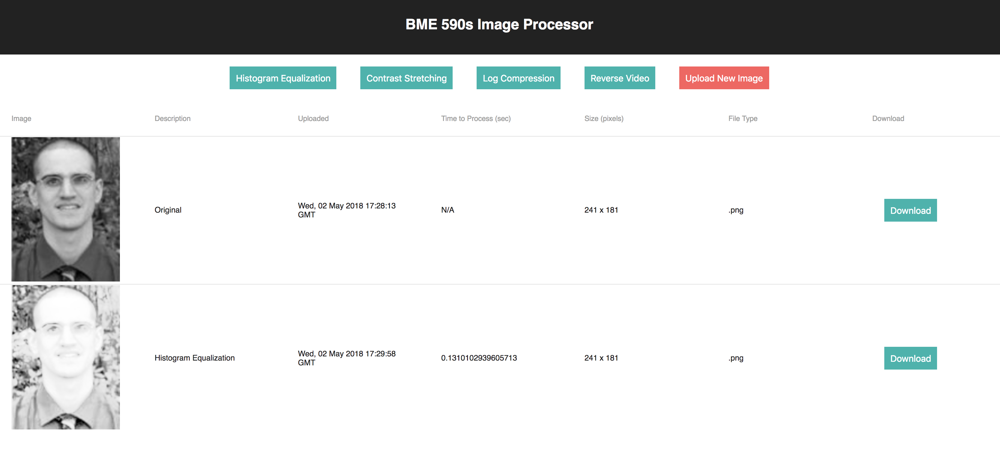
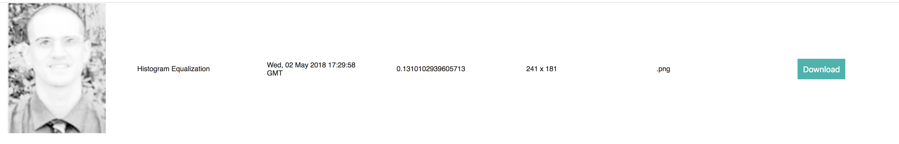

# ImageUploadFrontEnd (BME 590s Image Processor Final Project)
This React project creates a frontend client for users to upload and process images. Users can select the image file (color or grayscale) they want to upload from their local machine (`.jpg`, `.jpeg`, `.png`, `.tiff`) and then perform the following processes on the image:
* Histogram Equalization
* Contrast Stretching
* Log Compression
* Reverse Video

This frontend client satisfies the requirements laid out in the BME590s [Final Project markdown](https://github.com/mlp6/Medical-Software-Design/blob/master/FinalProjects/ImageProcessorS18/ImageProcessorS18.md).

## Running the app
To run this React app, simply run the following command from the root level of this repository:  
1) `npm install`  
2) `npm run start`

## Supported filetypes
`.jpg`, `.jpeg`, `.png`, `.tiff` are the supported file types. 

Both color and grayscale images are supported. 

At this time, mulitple image upload is **NOT** supported. If the user selects multiple images to upload, they will see a warning and only the first image will be uploaded and displayed in the client. 

## Uploading images
To upload an image, simply click the dropzone or drag an image onto the dropzone: 

You can also upload a new image at any time by clicking on the `Upload New Image` button: 

## Processing images
Once you've uploaded an image from your local machine, you can select any of the processes listed above to perform. For Contrast Stretching, you'll be prompted for a range `[min, max]`: 

Once an image process has completed, the result will be displayed along with the original image and any other processes you have completed: 

Images are dispalyed with:
* Description - which process was applied to the image
* Uploaded - date and time when the image was uploaded or the process was completed
* Time to Process - time each process took in seconds
* Size - dimensions of the image in pixels
* File type - file type of the image

## Downloading images
All images displayed (both original and processed) can be downloaded to your local machine. Simply click on the Download button next to each image: 

